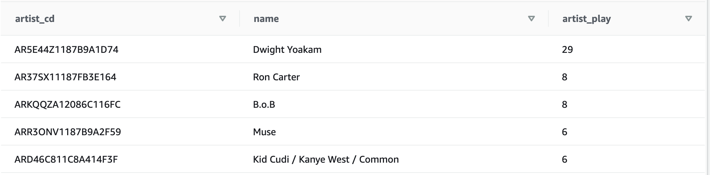
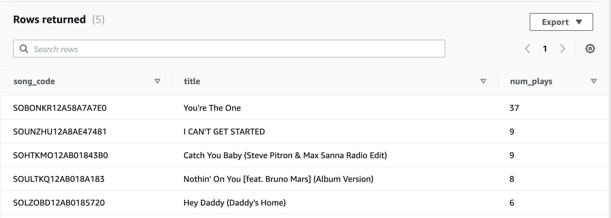

# DATA WAREHOUSING WITH REDSHIFT

This project involved creating a data warehouse in Redshift by loading files from S3 buckets
into staging tables and spreading the data into the relevant final tables desgined using the 
star schema.

The datasets include:
1. Song data
2. Log data

The schema tables

1. Fact table: 
    - Songplays

2. Dimension tables:
    - Users
    - Artists
    - Time
    - Songs

## Files in Repo

4 files were used for this project, apart from the README.

1. *create_tables.py*: This script drops all the tables and recreates them.

2. *etl.py*: This script loads the staging tables and the analytics tables.

3. *sql_queries.py*: This file contains all the SQL queries for creating tables
    and loading data into them.
    
4. *dwh.cfg*: This file contaisn all the configuration variables used in the different scripts

## Usage

The pipeline is designed to run in order.
This assumes all the queries in sql_queries.py are correctly specified.

First, create the tables

```bash
python create_tables.py
```

Then, load the data

```bash
python etl.py
```

## Sample queries

Two simple queries were run to show some of the types of insights we can glean from the warehouse.

### 1. Who are the top 5 artists being listened to by our premium users?

```sql
select sp.artist_id as artist_cd, a.name, count(sp.artist_id) as artist_play
from songplays sp
join artists a
on sp.artist_id = a.artist_id
and sp.level = 'paid'
group by artist_cd, name
order by artist_play desc
limit 5;
```

Result




### 2. What songs are most listened to?

```sql
select sp.song_id as song_code, s.title, count(sp.song_id) as num_plays
from songplays sp
join songs s
on sp.song_id = s.song_id
group by song_code, title
order by num_plays desc
limit 5;
```

Result




## NOTE
All cluster and database details have been removed from dwh.cfg fro security reasons.
The assumption is that you already have a running Redshift cluster.
